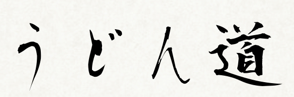

<p align="center">
  
</p>
ロゴは仮です
- - -
[](https://circleci.com/gh/MaxMEllon/udon-dou)
[](https://codeclimate.com/github/MaxMEllon/udon-dou)
[](https://codeclimate.com/github/MaxMEllon/udon-dou/coverage)
[](https://github.com/MaxMEllon/udon-dou/releases/latest)
[](https://github.com/MaxMEllon/udon-dou/blob/master/LICENSE.txt)
[](https://gitter.im/MaxMEllon/udon-dou?utm_source=badge&utm_medium=badge&utm_campaign=pr-badge)

## Description

`うどんどう`は，うどん好きがつくるうどん好きのためのうどん口コミサービスです．
さぬきうどんだけではなく，全国のうどんに焦点を当てます．
また，ほうとうやきしめんなどをうどんにいれるかどうかの議論・討論する場を
提供します

## Features

## Usage

## Requirement

- ruby  2.2.0
- rails 4.2.3
- postgresql
- gems  : Gemfile を参照してください
- bower : Bowerfileを参照してください

## How to run

```sh
$ git clone https://github.com/MaxMEllon/udon-dou.git
$ bundle install
$ rake db:create
$ rake db:migrate
$ bundle exec rake bower:install
$ bundle exec rake bower:resolve
$ rails s
```

## Author

[@maxmellon](https://github.com/MaxMEllon)

## LICENSE

This software is released under the MIT License, see LICENSE.txt.

:memo: TODO:

- [ ] 必要最低限の機能が実装されたら rebaseでcommitをひとまとめに
- [ ] ロゴを書く

